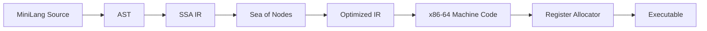

# Plan 1

Below is a structured two-semester course plan for a Compiler and Runtime Design course, designed for 3rd-year bachelor students with prerequisites in C, C++, assembly, algorithms, OS, and low-level programming. The course emphasizes incremental implementation, automated testing, and flexibility in implementation language choice.

---

### **Course Overview**
- **Language**: "MiniLang" (procedural language, gradually extended)
- **Target**: LLVM IR (semester 1), custom runtime + GC (semester 2)
- **Testing**: JSON-based AST checks, executable output validation, CI/CD pipelines
- **Tools**: LLVM, Git, Docker, Python/pytest for test automation

---

### **Semester 1: Compiler Fundamentals**
#### **Goal**: Build a working compiler for procedural language → LLVM IR.

| Week | Topics                                                                 | Homework Assignment                                                                                                | Testing Method                                                                                     |
|------|------------------------------------------------------------------------|-------------------------------------------------------------------------------------------------------------------|----------------------------------------------------------------------------------------------------|
| 1    | Course intro, AST design, JSON output                                 | **Setup**: Generate AST for `3 + 5 * 2` in JSON format. Output: `{"op":"+", "left":3, "right":{"op":"*", "left":5, "right":2}}` | Automated JSON comparison (ignoring whitespace/key order).                                         |
| 2    | Lexical analysis, regex/DFA, token streams                            | **Lexer**: Tokenize MiniLang code (integers, operators, keywords). Output tokens as JSON array.                   | Validate token stream JSON against expected output.                                                |
| 3    | Recursive descent/parser combinators, error recovery                  | **Parser**: Build AST from tokens. Support arithmetic expressions and `print`. Output AST as JSON.                | AST JSON comparison (100+ test cases: valid/invalid programs).                                     |
| 4    | Symbol tables, type checking (integers only)                          | **Semantic analysis**: Reject undeclared variables, type mismatches. Output error messages or annotated AST.      | Test error handling (e.g., `x + 1` without `x` declaration → expected error).                     |
| 5    | LLVM IR basics, instruction selection                                 | **Codegen**: Compile AST (arithmetic expressions + `print`) → LLVM IR. Executable must run and print results.     | Run compiled binaries, compare stdout to expected output (e.g., `print(3+2)` → "5").               |
| 6    | Control flow: branches, loops (LLVM `br`, `phi`)                      | **Add `if`/`while`**: Compile conditionals/loops to LLVM IR.                                                      | Test loops/factorial (e.g., `while`-based factorial(5) → 120).                                    |
| 7    | Functions, call stacks, calling conventions                           | **Functions**: Support declarations/calls. Compile recursive functions (e.g., Fibonacci).                         | Test recursion (fib(10) → 55).                                                                    |
| 8    | Arrays, structs, memory layout                                        | **Arrays**: Handle `int[10]` and structs. Generate GEP instructions.                                              | Test array summation/struct field access.                                                          |
| 9    | Midterm review                                                        | **MiniLang 1.0**: Compile a subset (vars, loops, functions, arrays) → LLVM IR.                                    | Test suite (20 programs) with output validation.                                                   |

---

### **Semester 2: Runtime Systems & Advanced Features**
#### **Goal**: Extend language (ADTs, GC), build runtime.

| Week | Topics                                                                 | Homework Assignment                                                                                                | Testing Method                                                                                     |
|------|------------------------------------------------------------------------|-------------------------------------------------------------------------------------------------------------------|----------------------------------------------------------------------------------------------------|
| 1    | ADTs: variants, pattern matching                                      | **ADTs**: Add `enum` (e.g., `Option<T>`). Compile to tagged structs in LLVM IR.                                   | Test pattern matching (e.g., `Option::Some(5)` → extract value).                                  |
| 2    | Memory allocation strategies, malloc/free                             | **Runtime base**: Implement `malloc`/`free` in C. Link with compiled code.                                        | Stress tests (allocate/free 10K objects → no crashes).                                             |
| 3    | Garbage collection: mark-sweep, reference counting                   | **GC**: Implement mark-sweep. Inject root stack scanning.                                                         | Test: Allocate cyclic graph, trigger GC, verify heap recovery.                                    |
| 4    | Advanced GC: generational, copying                                    | **Optimize GC**: Add generational collection.                                                                     | Benchmark: Measure pause times vs. allocation rate.                                               |
| 5    | Concurrency: threads, mutexes                                         | **Threads**: Add `thread_create`/`join`. Implement mutexes in runtime.                                            | Test race conditions (e.g., 10 threads increment shared counter → check final value).              |
| 6    | Debugging: stack traces, GC safe points                               | **Debug runtime**: Add stack traces on crash. Integrate with GC.                                                  | Inject crashes, verify stack trace output.                                                        |
| 7    | Optimization: inlining, constant propagation                          | **Compiler opt**: Implement AST-level optimizations (e.g., constant folding).                                      | Check optimized IR for eliminated operations (e.g., `3*2` → `6`).                                 |
| 8    | FFI: Calling C from MiniLang                                          | **FFI**: Add `extern` functions. Handle type marshalling.                                                         | Test calling `libc` (e.g., `extern print_str(char*)`).                                            |
| 9    | Final project                                                         | **MiniLang 2.0**: Full compiler + runtime with ADTs, GC, threads.                                                 | Demo (e.g., concurrent linked list with GC).                                                       |

---

### **Automated Testing Strategy**
1. **AST/JSON Testing**:
   - **Tool**: Python + `pytest` with `json.loads()`.
   - **Method**: 
     - Students output ASTs as JSON.
     - Tests compare JSONs (ignoring key order/whitespace) using recursive equality checks.
     - Example test:
       ```python
       def test_parser():
           ast_json = run_compiler("program.ml", output_mode="json")
           expected = {"op": "+", "left": 3, "right": {"op": "*", "left": 5, "right": 2}}
           assert json_match(ast_json, expected)  # Custom comparator
       ```

2. **Executable Output Testing**:
   - **Tool**: Docker + Bash scripts.
   - **Method**:
     - Compile MiniLang → LLVM IR → binary using `clang`.
     - Run the binary and capture `stdout`.
     - Compare against expected output:
       ```bash
       #!/bin/bash
       ./minilang_compiler program.ml > program.ll
       clang program.ll runtime.c -o program
       ./program > output.txt
       diff output.txt expected.txt
       ```

3. **GC/Runtime Testing**:
   - **Tool**: Valgrind, custom allocation trackers.
   - **Method**:
     - Inject GC logging (e.g., `GC_DEBUG=1`).
     - Verify heap state after collections:
       ```c
       // In runtime.c
       void gc_debug() { fprintf(stderr, "GC: %d objects collected\n", collected); }
       ```

4. **CI Pipeline**:
   - **Tools**: GitHub Actions/GitLab CI.
   - **Steps**:
     - Build compiler in Docker container.
     - Run test suite (AST + executable tests).
     - Fail on output mismatch/memory leaks.

---

### **Required Tools & Resources**
1. **Core**:
   - LLVM 15+ (for IR generation)
   - Clang (for compiling IR)
   - Docker (consistent testing)
2. **Testing**:
   - Python + `pytest` (AST/JSON tests)
   - Valgrind (memory/GC checks)
3. **Textbooks**:
   - _Engineering a Compiler_ (Cooper & Torczon)
   - _The Garbage Collection Handbook_ (Jones et al.)
4. **Templates**:
   - Starter code: GitHub repo with JSON schema, runtime skeleton, test harness.
   - Example test suite (50+ tests per assignment).

---

### **Key Design Choices**
- **Flexibility**: Students use any language (Python, Rust, Haskell, etc.) for their compiler.
- **Incremental Complexity**: Start with integers → control flow → functions → ADTs → GC → concurrency.
- **Automation**: CI runs tests on every commit, provides immediate feedback.
- **Real-World Skills**: LLVM integration, CI/CD, memory management.

## MiniLang

Below is an incremental specification of **MiniLang** with Scala-inspired syntax, designed for step-by-step implementation in the course. Each version adds new features to the language, accompanied by EBNF grammar and examples.

---

### **MiniLang Evolution with EBNF Grammars**
*Key: `?` = optional, `*` = 0-or-more, `+` = 1-or-more, `|` = or*

---

### **Version 1: Arithmetic & Print (Weeks 1-3)**
**Features**: Integers, arithmetic, `print`  
**Example**:
```scala
print(3 + 5 * 2)  // Output: 13
```

**EBNF**:
```ebnf
program     = { statement } ;
statement   = "print", "(", expr, ")", ";" ;
expr        = term, { ("+" | "-") term } ;
term        = factor, { ("*" | "/") factor } ;
factor      = integer | "(", expr, ")" ;
integer     = digit, { digit } ;
digit       = "0" | "1" | ... | "9" ;
```

---

### **Version 2: Variables & Blocks (Week 4)**
**Features**: `val`, scoped blocks, variable references  
**Example**:
```scala
val x = 10;
{
  val y = x * 2;
  print(y)  // Output: 20
}
```

**EBNF Additions**:
```ebnf
statement   = ... 
            | "val", identifier, "=", expr, ";" 
            | block ;
block       = "{", { statement }, "}" ;
factor      = ... | identifier ;
identifier  = letter, { letter | digit | "_" } ;
```

---

### **Version 3: Control Flow (Week 6)**
**Features**: `if`/`else`, `while`, comparisons  
**Example**:
```scala
val n = 5;
var fact = 1;
var i = 1;
while (i <= n) {
  fact = fact * i;
  i = i + 1;
}
print(fact)  // Output: 120
```

**EBNF Additions**:
```ebnf
statement   = ... 
            | "if", "(", expr, ")", statement, [ "else", statement ]
            | "while", "(", expr, ")", statement 
            | identifier, "=", expr, ";" ;  // Assignment

expr        = ... 
            | expr, ("==" | "!=" | "<" | "<=" | ">" | ">="), expr ;
```

---

### **Version 4: Functions (Week 7)**
**Features**: Functions, recursion, return values  
**Example**:
```scala
def fib(n: Int): Int = 
  if (n <= 1) n 
  else fib(n-1) + fib(n-2)

print(fib(10))  // Output: 55
```

**EBNF Additions**:
```ebnf
program     = { func_def | statement } ;
func_def    = "def", identifier, "(", [ params ], ")", ":", "Int", "=", expr ;
params      = identifier, ":", "Int", { ",", identifier, ":", "Int" } ;
factor      = ... | func_call ;
func_call   = identifier, "(", [ args ], ")" ;
args        = expr, { ",", expr } ;
```

---

### **Version 5: Arrays & Structs (Week 8)**
**Features**: Arrays, structs, indexing  
**Example**:
```scala
struct Point = { x: Int, y: Int }
val arr = [3]Point;
arr[0] = Point { x=1, y=2 };
print(arr[0].x)  // Output: 1
```

**EBNF Additions**:
```ebnf
type        = "Int" 
            | "[", expr, "]", type   // Array
            | identifier ;            // Struct type

expr        = ... 
            | "new", type            // Allocation
            | expr, "[", expr, "]"   // Indexing
            | expr, ".", identifier  ; // Field access

// Struct definition
program     = ... | "struct", identifier, "=", "{", field+, "}" ;
field       = identifier, ":", "Int", [ "," ] ;
```

---

### **Version 6: ADTs & Pattern Matching (Semester 2, Week 1)**
**Features**: Enums, variants, pattern matching  
**Example**:
```scala
enum Option = 
  | Some(value: Int) 
  | None

def safeDiv(a: Int, b: Int): Option = 
  if (b != 0) Some(a / b) else None

safeDiv(10, 2) match {
  case Some(x) => print(x)  // Output: 5
  case None    => print(0)
}
```

**EBNF Additions**:
```ebnf
program     = ... | "enum", identifier, "=", variant, { "|", variant } ;
variant     = identifier, [ "(", field, { ",", field }, ")" ] ;

expr        = ... | "match", expr, "{", case+, "}" ;
case        = "case", pattern, "=>", expr ;
pattern     = identifier, [ "(", pattern, { ",", pattern }, ")" ]  // Variant
            | "_"                                                 // Wildcard
            | integer ;                                           // Constant
```

---

### **Version 7: Concurrency (Semester 2, Week 5)**
**Features**: `spawn`, `join`, mutexes  
**Example**:
```scala
val mutex = newMutex()
var counter = 0

def worker() = 
  for (i <- 1 to 1000) {
    lock(mutex)
    counter = counter + 1
    unlock(mutex)
  }

val t1 = spawn worker()
val t2 = spawn worker()
join(t1)
join(t2)
print(counter)  // Output: 2000
```

**EBNF Additions**:
```ebnf
// Built-in functions
func_call   = ... 
            | "newMutex", "(", ")" 
            | "lock", "(", expr, ")" 
            | "unlock", "(", expr, ")" 
            | "spawn", expr 
            | "join", "(", expr, ")" ;
```

---

### **Grammar Summary**
```ebnf
program     = { (struct_def | enum_def | func_def | statement) } ;
statement   = "print", "(", expr, ")", ";" 
            | "val", identifier, "=", expr, ";" 
            | identifier, "=", expr, ";" 
            | "if", "(", expr, ")", statement, [ "else", statement ] 
            | "while", "(", expr, ")", statement 
            | block ;
block       = "{", { statement }, "}" ;
expr        = term, { ("+" | "-") term }
            | expr, ("==" | "!=" | "<" | "<=" | ">" | ">="), expr
            | "match", expr, "{", case+, "}"
            | func_call
            | "new", type ;
term        = factor, { ("*" | "/") factor } ;
factor      = integer 
            | identifier 
            | "(", expr, ")" 
            | expr, "[", expr, "]" 
            | expr, ".", identifier ;
```

---

### **Testing with Grammar Versions**
1. **Incremental Test Suites**:
   - Separate test folders per version (`v1/`, `v2/`, ...)
   - Example `v1` test:
     ```bash
     echo "print(3+2*4);" | ./compiler --ast | python tests/v1/test_arithmetic.py
     ```
2. **Grammar-Driven Tests**:
   - Use ANTLR or similar to generate valid/invalid programs for each grammar version
3. **AST/JSON Schema Evolution**:
   - Define JSON schema per version (e.g., `Node_v3 = { type: "Function", name: str, params: [...] }`)

---

### **Toolchain**
- **Grammar Tools**: ANTLR, Lark (for reference implementations)
- **JSON Schema**: Python `jsonschema` lib for AST validation
- **CI Tests**: GitHub Actions matrix testing across language versions:
  ```yaml
  strategy:
    matrix:
      version: [v1, v2, v3, v4, v5, v6, v7]
  steps:
    - run: ./run_tests.sh ${{ matrix.version }}
  ```

This incremental grammar allows students to build the compiler progressively while maintaining backward compatibility. The Scala-like syntax provides familiarity while focusing on compiler/runtime concepts.

# Plan 2

Below is the revised course structure focusing on modern IR optimizations (SSA, sea of nodes) and machine code generation, while reducing runtime/debugging topics. The two-semester plan maintains incremental language development but shifts emphasis to optimization and backend techniques.

---

### **Revised Two-Semester Course Structure**

#### **Semester 1: Compiler Frontend & Middle-End**
| Week | Topics                                                                 | Homework Assignment                                                                                                |
|------|------------------------------------------------------------------------|-------------------------------------------------------------------------------------------------------------------|
| 1    | AST design, JSON output                                               | Generate AST for `3 + 5 * 2` → JSON                                                                               |
| 2    | Lexical analysis w/ regex/DFA                                         | Tokenize arithmetic expressions → JSON tokens                                                                     |
| 3    | Recursive descent parsing                                             | Parse arithmetic + `print` → AST JSON                                                                             |
| 4    | Symbol tables, type checking                                           | Validate variable scopes/types → Annotated AST                                                                    |
| 5    | **SSA Form**: Phi nodes, dominance frontiers                          | **Convert CFG to SSA** for basic blocks                                                                           |
| 6    | **SSA Optimizations**: Constant propagation, DCE                      | **Optimize SSA IR**: Fold `x = 3*2; y = x+1` → `y = 7`                                                           |
| 7    | Control flow → LLVM IR                                                 | Compile `if`/`while` → LLVM IR                                                                                    |
| 8    | Functions → LLVM IR                                                    | Compile recursive functions (e.g., Fibonacci)                                                                     |
| 9    | **Midterm**: Full frontend → SSA IR                                   | Compile functions + control flow → Optimized SSA IR                                                               |

#### **Semester 2: Backend & Advanced Optimizations**
| Week | Topics                                                                 | Homework Assignment                                                                                                |
|------|------------------------------------------------------------------------|-------------------------------------------------------------------------------------------------------------------|
| 1    | **Sea of Nodes IR**: Global value numbering                           | **Translate SSA → Sea of Nodes** (GVN-based)                                                                      |
| 2    | **Node-Based Optimizations**: Loop invariant code motion              | **Optimize loops** in Sea of Nodes IR                                                                             |
| 3    | **Machine Code Gen**: Instruction selection (tree matching)            | **Select x86-64 instructions** for arithmetic expressions                                                         |
| 4    | **Register Allocation**: Linear scan algorithm                        | **Allocate registers** for function with 6+ variables                                                             |
| 5    | **Advanced Allocation**: Graph coloring, spilling                     | **Handle register pressure** in nested loops                                                                      |
| 6    | ADTs: Tagged unions, pattern matching                                 | Compile `Option<T>` with pattern matching                                                                         |
| 7    | **Runtime Lite**: malloc/free, mark-sweep GC basics                   | **Integrate GC** with compiler output                                                                             |
| 8    | **Optimized GC**: Generational collection                             | **Add generational GC** with fast/slow paths                                                                      |
| 9    | **Final**: Full pipeline (Frontend → Sea of Nodes → x86-64)           | Compile MiniLang → Optimized assembly with register allocation                                                    |

---

### **MiniLang Evolution with Optimizations Focus**
*Syntax: Scala-like, EBNF builds on previous versions*

#### **V1-4: Base Language** (Same as before: arithmetic, vars, control flow, functions)

#### **V5: SSA-Ready Constructs** (Week 5)
```scala
def factorial(n: Int): Int = {
  var acc = 1
  var i = 1
  while (i <= n) {
    acc = acc * i
    i = i + 1
  }
  acc  // SSA challenge: Phi nodes for acc/i
}
```
**EBNF Additions** for SSA:
```ebnf
basic_block = statement { statement } [ terminator ] ;
terminator  = "return" expr 
            | "if" "(" expr ")" "goto" label "else" "goto" label
            | "goto" label ;
```

#### **V6: Sea of Nodes Input** (Week 1-2, Semester 2)
```scala
// Example leveraging GVN
def sum(a: Int, b: Int): Int = {
  val x = a * 3
  val y = b * 3  // GVN: Recognize identical 3* pattern
  x + y
}
```

#### **V7: Machine Code Features** (Weeks 3-5)
```scala
// Register pressure test
def matrixMult(a: Int, b: Int, c: Int, d: Int, 
               e: Int, f: Int, g: Int, h: Int): Int = {
  // Force spilling with 8+ variables
  val r1 = a * e + b * g
  val r2 = a * f + b * h
  val r3 = c * e + d * g
  val r4 = c * f + d * h
  r1 + r2 + r3 + r4
}
```

#### **V8: ADTs + GC Integration** (Weeks 6-8)
```scala
enum List = 
  | Cons(head: Int, tail: List)
  | Nil

def range(n: Int): List = 
  if (n <= 0) Nil 
  else Cons(n, range(n-1))  // GC stress test
```

---

### **Testing Strategy for New Topics**

1. **SSA Validation**  
   **Tool**: Custom SSA checker + `llvm-dis`  
   **Test**:  
   ```python
   # Check for phi nodes in output
   def test_phi_nodes(ssa_ir):
       assert "%acc.phi" in ssa_ir, "Missing phi node"
   ```

2. **Sea of Nodes Optimization**  
   **Tool**: Node graph visualizer + metric checks  
   **Test**:  
   ```python
   # Verify GVN reduced nodes
   pre_opt_nodes = count_nodes(ir_before)
   post_opt_nodes = count_nodes(ir_after)
   assert post_opt_nodes < pre_opt_nodes * 0.7
   ```

3. **Register Allocation**  
   **Tool**: x86-64 emulator + spill counter  
   **Test**:  
   ```bash
   # Count memory accesses in assembly
   objdump -d output.o | grep 'mov.*\[' | wc -l
   # Require < threshold for given test
   ```

4. **GC Integration**  
   **Tool**: Valgrind massif  
   **Test**:  
   ```bash
   valgrind --tool=massif ./program
   ms_print massif.out | grep "total heap"
   ```

---

### **Key Tools & Resources**
1. **Optimization & Codegen**:
   - **SSA**: LLVM SSA docs, Cytron's paper
   - **Sea of Nodes**: GraalVM papers, V8 TurboFan docs
   - **Register Allocation**: Appel's book, RISC-V manual
2. **Testing**:
   - **IR Validation**: FileCheck (LLVM), custom graph analyzers
   - **Assembly Testing**: QEMU user-mode, Unicorn engine
   - **Benchmarks**: CSiBE, Embench
3. **Infrastructure**:
   - GitHub Classroom with autograding
   - Docker images with LLVM 17+, RISC-V toolchain
   - Jupyter notebooks for IR visualization

---

### **Removed/Reduced Topics**
1. **Concurrency**: Removed thread/Mutex support
2. **Debugging**: Reduced stack traces to optional extra credit
3. **FFI**: Removed C interop
4. **Advanced GC**: Simplified to 1-week generational GC

---

### **Sample Final Workflow**


This revised curriculum gives students hands-on experience with:
- Modern IRs (SSA, sea of nodes)
- Optimization techniques (GVN, LICM)
- Machine code generation (instruction selection)
- Register allocation under pressure
While maintaining core compiler/runtime concepts through ADTs and GC integration.
This structure ensures students build a complete compiler/runtime system in manageable steps, with robust automated verification at every stage.
